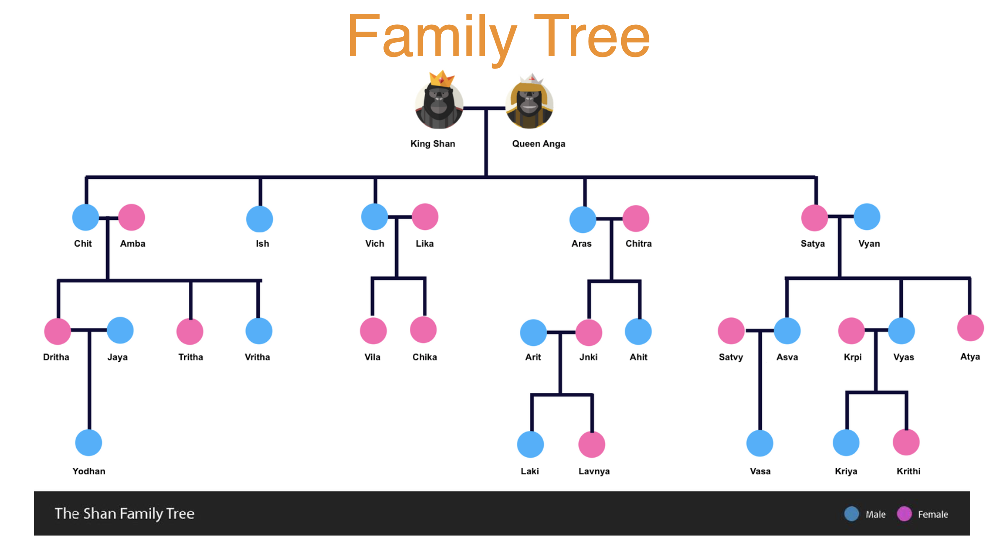
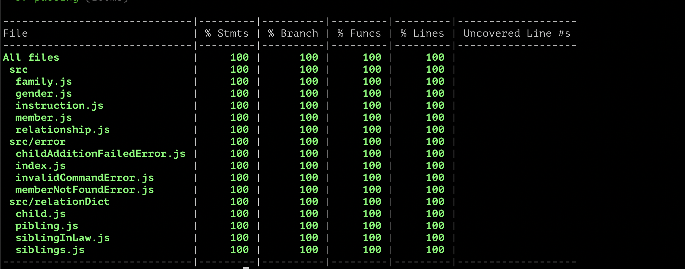

# Introduction
This is a code repo for meet the family problem statement
More details: https://www.geektrust.in/coding-problem/backend/family

# Default Setup
By default King Shan and Queen Anga are the head of the family.
Default family tree setup is in **setup.js**.



# Setup
```
npm init
```

# How to run code
```
  npm install
  node geektrust.js <file>.txt
```
**Note**: If no file provided along with geektrust.js it will take input.txt as default file. There are two instructions supports by program:
* **Addding a child:**
    This instruction add a new child to family tree.
    Format:
    ```
      ADD_CHILD Pjali Srutak Male
    ```
    **Here**
    -  Pjali is mother name
    - Srutak is new member name
    - Male is gender for given new member.

    Output:
    ```
    CHILD_ADDITION_SUCCEEDED
    ```

* **Getting a member by relationship:**
    This instruction fetch a member using relationship with given member.

    Format:
    ```
      GET_RELATIONSHIP Atya Sister-In-Law
    ```
    **Here**
    -  Atya is member whose sister in law we have to find.

  Available relationships in program:
  ```
	SIBLINGS
	SON
	DAUGHTER
	SISTER_IN_LAW
	BROTHER_IN_LAW
	MATERNAL_AUNT
	PATERNAL_AUNT
	PATERNAL_UNCLE
	MATERNAL_UNCLE
  ```

  Output:
  ```
  Satvy Krpi
  ```
  

# Test
```
npm test --silent
```
Or
```
npm run test -- --coverage --watchAll=false
```

# code coverage

